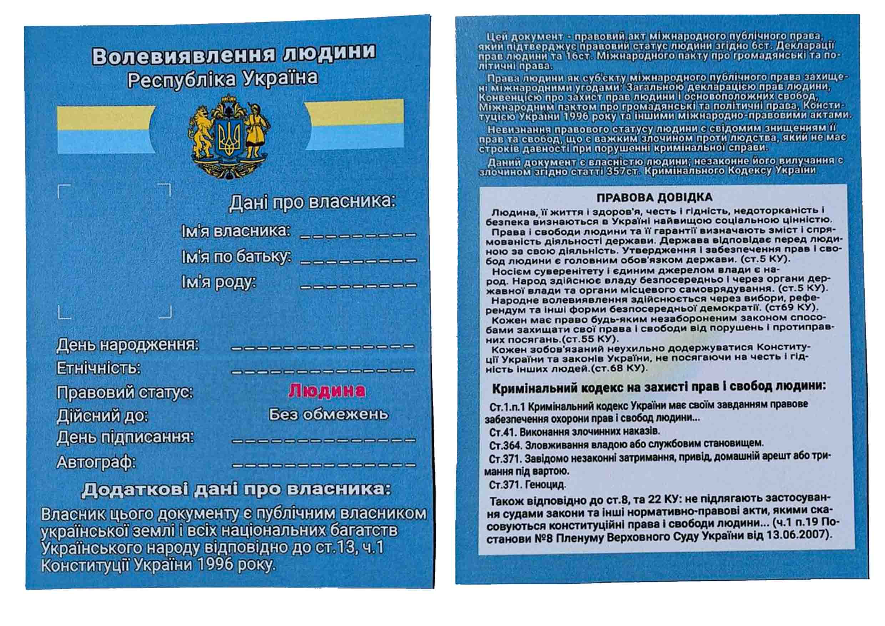

### Законний виїзд за кордон чоловікам 18-60р. через волевиявлення. Інструкція по заповненню. Частина 2

<iframe width="560" height="315" src="https://www.youtube.com/embed/wgOR8NxnEhc" frameborder="0" allow="accelerometer; autoplay; encrypted-media; gyroscope; picture-in-picture" allowfullscreen></iframe>

Усім привіт! У попередньому відеогляді ми розповідали про те, чи можливо виїхати за допомогою волевиявлення за кордон, яка цінність цього документу та якими статтями Конституції України це підтверджено. Сьогодні більш детально поговоримо про волевиявлення і як його заповнювати. Перш за все необхідно усвідомити те, що ви є людина і Конституція України створена для вас.

Щоб там не говорили, що свої права неможливо захистити, не вірте нікому, якщо рухатись вперед на досягнення своєї мети то все можливо, головне діяти у правовому полі та у статусі людини, бо саме людина є найвищою цінністю у світі, а не фізична особа. Але перед тим, як почати заповнювати волевиявлення давайте для початку розберемо що таке [«Воєнний Стан»](https://zakon.rada.gov.ua/laws/show/389-19#n5), та чим він відрізняється від стану війни. На відміну від стану війни ведення воєнного стану може бути запроваджений максимум на всій території України не більше, ніж на 90 діб, після чого, якщо проблема не вирішиться, обов'язково вводиться стан війни, а [«Воєнний Стан»](https://zakon.rada.gov.ua/laws/show/389-19#n5) не може бути продовжено, так як цей термін визначає саму загрозу втручання, а не тих наслідків, які вже трапились по всій території України.

Іншими словами, в [«Воєнний Стан»](https://zakon.rada.gov.ua/laws/show/389-19#n5) може водитись комендантська година, можуть активно призивати на службу військових та офіцерів запасу, але не обмежувати пересування людини та закривати кордони. Коли оголошується стан війни, тоді по Конституції настають обмеження. Обмеження на пересування, обмеження на користування інтернетом, всі підприємства переводяться на військову промисловість і так далі.

В нашому випадку **стану війни ніхто не вводив**, а вирішили незаконно продовжувати військовий стан, посилаючись на постанови Кабінету міністрів, які були придумані для **фізичних осіб** та не мають юридичної сили перед Конституцією України. Пам'ятайте, Конституція України є найвищою юридичною силою. Сподіваюсь, ви все це усвідомили.

Тепер давайте заповнювати волевиявлення. В телеграм-каналі, який є в шапці профілю, є бланк волевиявлення для друку.

Його необхідно завантажити та роздрукувати в фотоцентрі або в місці, яке надає послуги друку.

Після друку необхідно вклеїти своє фото. Заповнювати необхідно червоною або фіолетовою ручкою. Це важливо, тому що **чорні та сині кольори для фізосіб**.

- Спочатку заповнюємо **ім'я**,
- потім **по батькові**,
- потім своє **ім'я роду**, тобто прізвище.
- **День народження** пишемо у форматі цифра,
- потім місяць прописом
- і далі повністю рік цифрами, наприклад 01 лютого 1993 року,
- за таким принципом заповнюємо і дату підписання
- та ставимо особистий автограф у відповідній графі.
- \* Також можна використати свій відбиток пальця таким чином, щоб він був і на фото, і на самому документі, відбиток теж повинен бути червоного або фіолетового кольору.
  Як заповнили волевиявлення
  Після того, як заповнили волевиявлення, його необхідно заламінувати і носити з собою як основний ваш власний документ. Сподіваюсь, інструкція була корисною, а в наступних відео уже поговоримо про створення територіальних громад. До нових зустрічів!
