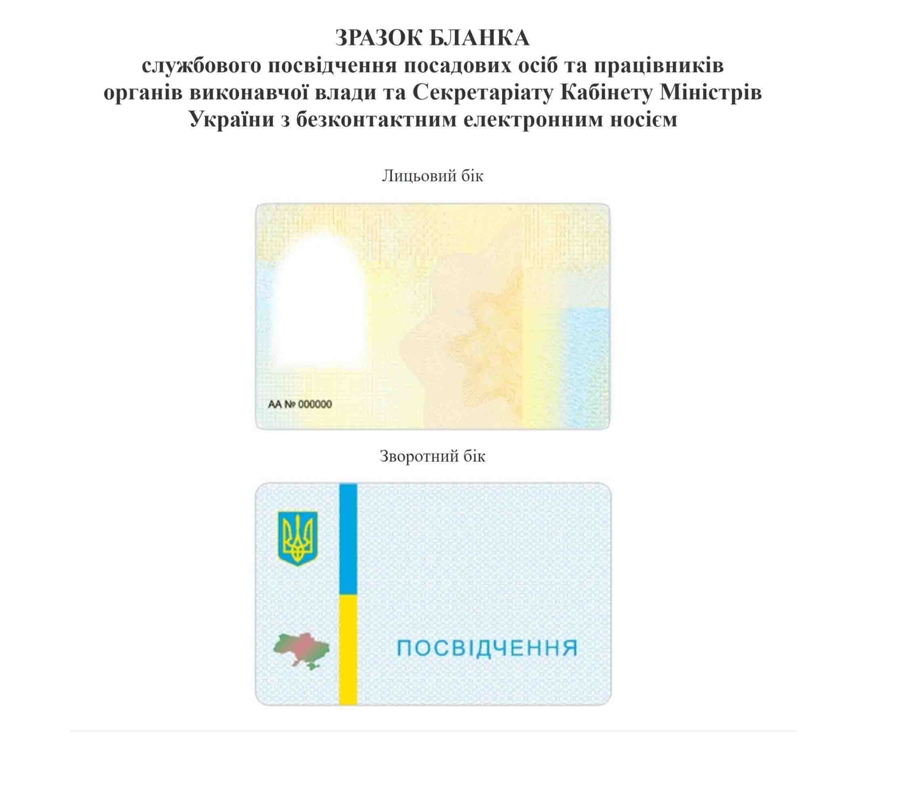

## Як поводитися при неправомірній зупинці співробітниками нібито офіційно існуючого ТЦК та СП (але краще, звичайно ж, якщо є можливість, то не вступати з ними в діалог взагалі):

**1.** ТЦК та СП зобов'язані пред'явити ДОКУМЕНТИ [згідно постанові КМУ No 1137 - про затвердження зразка та технічного опису бланка службового посвідчення з безконтактним електронним носієм] що підтверджують їх ПОВНОВАЖЕННЯ та озвучити ПІДСТАВИ [має бути письмовий наказ військового коменданта міста, що наділяє повноваженнями на перевірку документів з їх ФІО і все це з печаткою, підписом і датою].

_Усі накази військового коменданта можуть бути спрямовані виключно тільки для внутрішнього користування, всередині військової комендатури і не мають ніякого відношення до цивільних!_

- Фіксуємо спілкування на телефон, а їхні особисті документи читаємо вголос; - при пред'явленні будь-якої довіреності, спираємося на належну печатку і підпис згідно із законом:

[У К А З ПРЕЗИДЕНТА УКРАЇНИ Про офіційні символи глави держави ](https://zakon.rada.gov.ua/laws/show/1507/99)

- перевіряємо код ЄДРПОУ на друку і якщо його не існує в реєстрі, то акцентуємо увагу на тому, що друк підроблений і озвучуємо статтю - [358 ККУ Підробка Документів](https://zakon.rada.gov.ua/laws/show/2341-14#n2469)

**2.** Нагадуємо їм, що з 2007 року віиськкоматів не існує, а ТЦК та СП не є правонаступниками віиськкоматів і є [в кращому випадку] Суб'єктом Господарського Праву [стаття 8 господарського кодексу яка говорить - Що суб'єкти господарювання не є державними органами влади](https://zakon.rada.gov.ua/laws/show/436-15#n48)

Відповідно, вони приватна контора і можуть займатися виключно контрактниками, тобто на добровільній основі і наводимо законні постанови:

**- а)** [П О С Т А Н О В А від 22 серпня 2007 р. N 1054 Про затвердження Положення про територіальний центр комплектування військовослужбовцями за контрактом](https://zakon.rada.gov.ua/laws/show/1054-2007-%D0%BF#Text)

**- б)** [Положення про територіальні центри комплектування та соціальної підтримки затверджується Кабінетом Міністрів України.](https://zakon.rada.gov.ua/laws/show/2232-12#n30)

**3.** Якщо вони посилаються на Постанову 1456 [наказ по областях на перевірку документів] і намагаються маніпулювати пунктами *7 і *8, то акцентуємо їм, що там є ще на початку пункти *3 і *5. І в цій постанові ТЦК та СП не згадується від слова зовсім:

[Про затвердження Порядку перевірки документів в осіб, огляду речей, транспортних засобів, багажу та вантажів, службових приміщень і житла громадян під час забезпечення заходів правового режиму воєнного стану](https://zakon.rada.gov.ua/laws/show/1456-2021-%D0%BF#Text)

**4.** себе заявляти за правовим статусом як ЛЮДИНА, на підставі статті #6 Декларації прав людини ООН прийнятої в 1948 році.

5. Якщо ТЦК та СП викликають патрульну поліцію [або вже разом з ними], вимагаємо доки у поліцейського згідно із Законом про Поліцію (ст.18 п.3), плюс нагадуємо, що «у своїй діяльності поліція керується Конституцією України, міжнародними договорами України (ст.3 п.1), попереджаємо про відповідальність за передачу персональних даних третій особі ( ст.182 ККУ, закон про поліцію ст.19 п.1, ст.25 п.4 та ст.28 п.2):

[Стаття 182. Порушення недоторканності приватного життя](https://zakon.rada.gov.ua/laws/show/2341-14#n1197)

[ЗАКОН УКРАЇНИ Про Національну поліцію](https://zakon.rada.gov.ua/laws/show/580-19#Text)

6. Оскільки полицейский надає доповнення до жетону, а не службі посвідчення, показуємо як воно повинно виглядати [в ідеалі роздрукувати]:

7. Якщо продовжують розповідати, запитуємо, на підставі чого ви повинні пред'являти документи і слухати їх

[Закон про поліцію - стаття 32 з 6 пунктів - підстави для перевірки документів](https://zakon.rada.gov.ua/laws/show/580-19#n258)

8. Якщо вам розповідають про [«Воєнний Стан»](https://zakon.rada.gov.ua/laws/show/389-19#n5):

Вимагаємо копію Указу Президента України «Про введення [«воєнного стану»](https://zakon.rada.gov.ua/laws/show/389-19#n5) в Україні». Якщо покажуть, звертаємо увагу на те, що вона без особистого підпису [надруковано тільки ФІО] і гербової печатки президента [стоїть печатка ОП]:

[У К А З ПРЕЗИДЕНТА УКРАЇНИ Про офіційні символи глави держави](https://zakon.rada.gov.ua/laws/show/1507/99#o1)

За бажанням можна пояснити, чим відрізняється [«Воєнний Стан»](https://zakon.rada.gov.ua/laws/show/389-19#n5) [ЗАКОН УКРАЇНИ Про правовий режим воєнного стану](https://zakon.rada.gov.ua/laws/show/389-19#n3) від «Стан Війни»([Ст. 106 п. 19](https://www.president.gov.ua/ua/documents/constitution/konstituciya-ukrayini-rozdil-v#:~:text=%D0%BF%D0%BE%D0%B4%D0%B0%D0%BD%D0%BD%D1%8F%20%D0%BF%D1%80%D0%BE%20%D0%BE%D0%B3%D0%BE%D0%BB%D0%BE%D1%88%D0%B5%D0%BD%D0%BD%D1%8F-,%D1%81%D1%82%D0%B0%D0%BD%D1%83%20%D0%B2%D1%96%D0%B9%D0%BD%D0%B8,-%D1%82%D0%B0%20%D1%83%20%D1%80%D0%B0%D0%B7%D1%96) та [Ст. 85 п. 9](https://www.president.gov.ua/ua/documents/constitution/konstituciya-ukrayini-rozdil-iv#:~:text=%D0%BF%D0%BE%D0%B4%D0%B0%D0%BD%D0%BD%D1%8F%D0%BC%20%D0%9F%D1%80%D0%B5%D0%B7%D0%B8%D0%B4%D0%B5%D0%BD%D1%82%D0%B0%20%D0%A3%D0%BA%D1%80%D0%B0%D1%97%D0%BD%D0%B8-,%D1%81%D1%82%D0%B0%D0%BD%D1%83%20%D0%B2%D1%96%D0%B9%D0%BD%D0%B8,-%D1%96%20%D1%83%D0%BA%D0%BB%D0%B0%D0%B4%D0%B5%D0%BD%D0%BD%D1%8F%20%D0%BC%D0%B8%D1%80%D1%83)
КУ) [краще вивчити]:

- [«Воєнний Стан»](https://zakon.rada.gov.ua/laws/show/389-19#n5) і «Стан Війни»([Ст. 106 п. 19](https://www.president.gov.ua/ua/documents/constitution/konstituciya-ukrayini-rozdil-v#:~:text=%D0%BF%D0%BE%D0%B4%D0%B0%D0%BD%D0%BD%D1%8F%20%D0%BF%D1%80%D0%BE%20%D0%BE%D0%B3%D0%BE%D0%BB%D0%BE%D1%88%D0%B5%D0%BD%D0%BD%D1%8F-,%D1%81%D1%82%D0%B0%D0%BD%D1%83%20%D0%B2%D1%96%D0%B9%D0%BD%D0%B8,-%D1%82%D0%B0%20%D1%83%20%D1%80%D0%B0%D0%B7%D1%96) та [Ст. 85 п. 9](https://www.president.gov.ua/ua/documents/constitution/konstituciya-ukrayini-rozdil-iv#:~:text=%D0%BF%D0%BE%D0%B4%D0%B0%D0%BD%D0%BD%D1%8F%D0%BC%20%D0%9F%D1%80%D0%B5%D0%B7%D0%B8%D0%B4%D0%B5%D0%BD%D1%82%D0%B0%20%D0%A3%D0%BA%D1%80%D0%B0%D1%97%D0%BD%D0%B8-,%D1%81%D1%82%D0%B0%D0%BD%D1%83%20%D0%B2%D1%96%D0%B9%D0%BD%D0%B8,-%D1%96%20%D1%83%D0%BA%D0%BB%D0%B0%D0%B4%D0%B5%D0%BD%D0%BD%D1%8F%20%D0%BC%D0%B8%D1%80%D1%83)
  КУ) не можуть існувати одночасно. Або одне або інше.

- Указ президента без підпису та печатки, складено з порушенням вимог ДСТУ, [«Воєнний Стан»](https://zakon.rada.gov.ua/laws/show/389-19#n5) вводиться при загрозі нападу, а не при вторгненні на територію держави. При вторгненні оголошується «Стан Війни»([Ст. 106 п. 19](https://www.president.gov.ua/ua/documents/constitution/konstituciya-ukrayini-rozdil-v#:~:text=%D0%BF%D0%BE%D0%B4%D0%B0%D0%BD%D0%BD%D1%8F%20%D0%BF%D1%80%D0%BE%20%D0%BE%D0%B3%D0%BE%D0%BB%D0%BE%D1%88%D0%B5%D0%BD%D0%BD%D1%8F-,%D1%81%D1%82%D0%B0%D0%BD%D1%83%20%D0%B2%D1%96%D0%B9%D0%BD%D0%B8,-%D1%82%D0%B0%20%D1%83%20%D1%80%D0%B0%D0%B7%D1%96) та [Ст. 85 п. 9](https://www.president.gov.ua/ua/documents/constitution/konstituciya-ukrayini-rozdil-iv#:~:text=%D0%BF%D0%BE%D0%B4%D0%B0%D0%BD%D0%BD%D1%8F%D0%BC%20%D0%9F%D1%80%D0%B5%D0%B7%D0%B8%D0%B4%D0%B5%D0%BD%D1%82%D0%B0%20%D0%A3%D0%BA%D1%80%D0%B0%D1%97%D0%BD%D0%B8-,%D1%81%D1%82%D0%B0%D0%BD%D1%83%20%D0%B2%D1%96%D0%B9%D0%BD%D0%B8,-%D1%96%20%D1%83%D0%BA%D0%BB%D0%B0%D0%B4%D0%B5%D0%BD%D0%BD%D1%8F%20%D0%BC%D0%B8%D1%80%D1%83)
  КУ).

- Ні Президент, ні ВР, ні РНБО не мають повноважень продовжувати [«Воєнний Стан»](https://zakon.rada.gov.ua/laws/show/389-19#n5).

- Це означає, що [«Воєнний Стан»](https://zakon.rada.gov.ua/laws/show/389-19#n5) не діє.

Ще раз про печатку:

[У К А З ПРЕЗИДЕНТА УКРАЇНИ Про Велику Державну Печатку України](https://zakon.rada.gov.ua/laws/show/1230/96#Text)

10. Якщо проти вас починають силові дії, нагадуємо статті про незаконне позбавлення волі:

📌 [Карний кодекс України ст. 146 «Незаконне позбавлення волі або викрадення людини»](https://zakon.rada.gov.ua/laws/show/2001-05#o958)

📌 [Карний Кодекс України ст. 371 «Завідомо незаконні затримання, привід, домашній арешт або тримання під вартою»](https://zakon.rada.gov.ua/laws/show/2341-14#n2656)

Якщо продовжують проти вас протиправні дії, зателефонуйте 102, викликаєте СОГ [слідчо-оперативна група] з кодом «Бета» [негайне оперативне реагування].

11. Якщо ж вас таки насильно привезли до ТЦК та СП, там говоримо все те ж саме – про нелегальність [«Воєнний Стан»](https://zakon.rada.gov.ua/laws/show/389-19#n5), мобілізації, вимагаємо статут.

Згідно зі [статтею 19 Конституції України](https://www.president.gov.ua/ua/documents/constitution/konstituciya-ukrayini-rozdil-i#:~:text=%D0%A1%D1%82%D0%B0%D1%82%D1%82%D1%8F%2019.,%D0%B7%D0%B0%D0%BA%D0%BE%D0%BD%D0%B0%D0%BC%D0%B8%20%D0%A3%D0%BA%D1%80%D0%B0%D1%97%D0%BD%D0%B8.) вони зобов'язані діяти відповідно і на основі Конституції.

Згідно зі [статтею 63 Конституції України, ви можете не свідчити проти себе](https://www.president.gov.ua/ua/documents/constitution/konstituciya-ukrayini-rozdil-ii#:~:text=%D0%A1%D1%82%D0%B0%D1%82%D1%82%D1%8F%2063.,%D0%B2%D0%B8%D1%80%D0%BE%D0%BA%D0%BE%D0%BC%20%D1%81%D1%83%D0%B4%D1%83.).

- Нічого не боїмося і стоїмо на своєму.
- Нічого не підписуємо.
- Особисті дані ми не надаємо.

Додамо щодо відеофіксації:

📌 [ст. #21](https://zakon.rada.gov.ua/laws/show/2657-12#n128), [ст. #29](https://zakon.rada.gov.ua/laws/show/2657-12#n186) ЗАКОНу УКРАЇНИ Про інформацію

📌 [стаття #37](https://zakon.rada.gov.ua/laws/show/435-15#n231) Цивільного кодексу

📌 [статті #34](https://www.president.gov.ua/ua/documents/constitution/konstituciya-ukrayini-rozdil-ii#:~:text=%D0%A1%D1%82%D0%B0%D1%82%D1%82%D1%8F%2034.,%D0%BD%D0%B5%D1%83%D0%BF%D0%B5%D1%80%D0%B5%D0%B4%D0%B6%D0%B5%D0%BD%D0%BE%D1%81%D1%82%D1%96%20%D0%BF%D1%80%D0%B0%D0%B2%D0%BE%D1%81%D1%83%D0%B4%D0%B4%D1%8F.) Конституції України

Ви маєте право на відеозйомку:

- якщо ви перебуваєте НЕ у військовій частині [ТЦК та СП не є військовою частиною]

- НЕ поблизу військового або стратегічного інфраструктурного об'єкта

- Не поблизу дороги, по якій зараз проходить військова техніка

- а також, представники ТЦК та СП в момент своєї роботи НЕ представники ВСУ, а ДОВІЛЬНІ ОСОБИ, а посадова особу - МОЖНА ЗНІМАТИ на камеру.

Ну а враховуючи, що в реальності вони не посадові особи, а фактично злочинці [незаконні воєнізовані форми заборонені на території України], то не забуваємо про фізичний самозахист [заходи необхідної самооборони]:

📌 ст. [#27](https://www.president.gov.ua/ua/documents/constitution/konstituciya-ukrayini-rozdil-i#:~:text=%D0%A1%D1%82%D0%B0%D1%82%D1%82%D1%8F%2027.,%D0%BF%D1%80%D0%BE%D1%82%D0%B8%D0%BF%D1%80%D0%B0%D0%B2%D0%BD%D0%B8%D1%85%20%D0%BF%D0%BE%D1%81%D1%8F%D0%B3%D0%B0%D0%BD%D1%8C.), [#55](https://www.president.gov.ua/ua/documents/constitution/konstituciya-ukrayini-rozdil-ii#:~:text=%D0%A1%D1%82%D0%B0%D1%82%D1%82%D1%8F%2055.,%D0%BF%D1%80%D0%BE%D1%82%D0%B8%D0%BF%D1%80%D0%B0%D0%B2%D0%BD%D0%B8%D1%85%20%D0%BF%D0%BE%D1%81%D1%8F%D0%B3%D0%B0%D0%BD%D1%8C.) Конституції України

📌 ст. [#36](https://zakon.rada.gov.ua/laws/show/2341-14#n158), [#39](https://zakon.rada.gov.ua/laws/show/2341-14#n172) Кримінального кодексу України.

Не забуваємо також про [статтю #29](https://www.president.gov.ua/ua/documents/constitution/konstituciya-ukrayini-rozdil-ii#:~:text=%D0%A1%D1%82%D0%B0%D1%82%D1%82%D1%8F%2029.,%D0%BD%D0%B5%D0%B4%D0%BE%D1%82%D0%BE%D1%80%D0%BA%D0%B0%D0%BD%D0%BD%D1%96%D1%81%D1%82%D1%8C.) КУ - Кожна людина має право на свободу та особисту недоторканність.

А також стаття КУ [#157](https://www.president.gov.ua/ua/documents/constitution/konstituciya-ukrayini-rozdil-xiii#:~:text=%D0%A1%D1%82%D0%B0%D1%82%D1%82%D1%8F%20157.,%D0%BD%D0%B0%D0%B4%D0%B7%D0%B2%D0%B8%D1%87%D0%B0%D0%B9%D0%BD%D0%BE%D0%B3%D0%BE%20%D1%81%D1%82%D0%B0%D0%BD%D1%83.) - Конституція України не може бути змінена, якщо зміни передбачають скасування чи обмеження прав і свобод людини і громадянина або якщо вони спрямовані на ліквідацію незалежності чи на порушення територіальної цілісності України.

І невелика ремарка з приводу [ст. #260](https://zakon.rada.gov.ua/laws/show/80732-10#n534) Кодексу України про адміністративні правопорушення, в якій передбачена міра забезпечення - адміністративне затримання. Вона може застосовуватися тільки у виняткових випадках, до яких **відмова виконувати вимоги ТЦК - НЕ стосується!**
